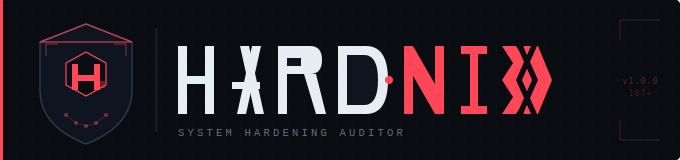
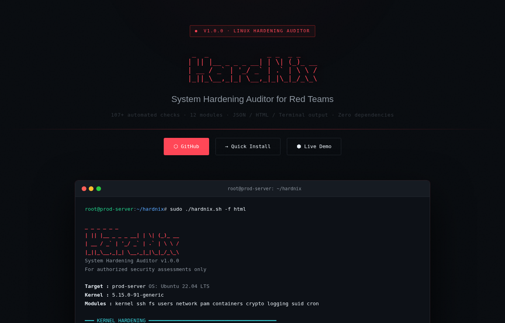
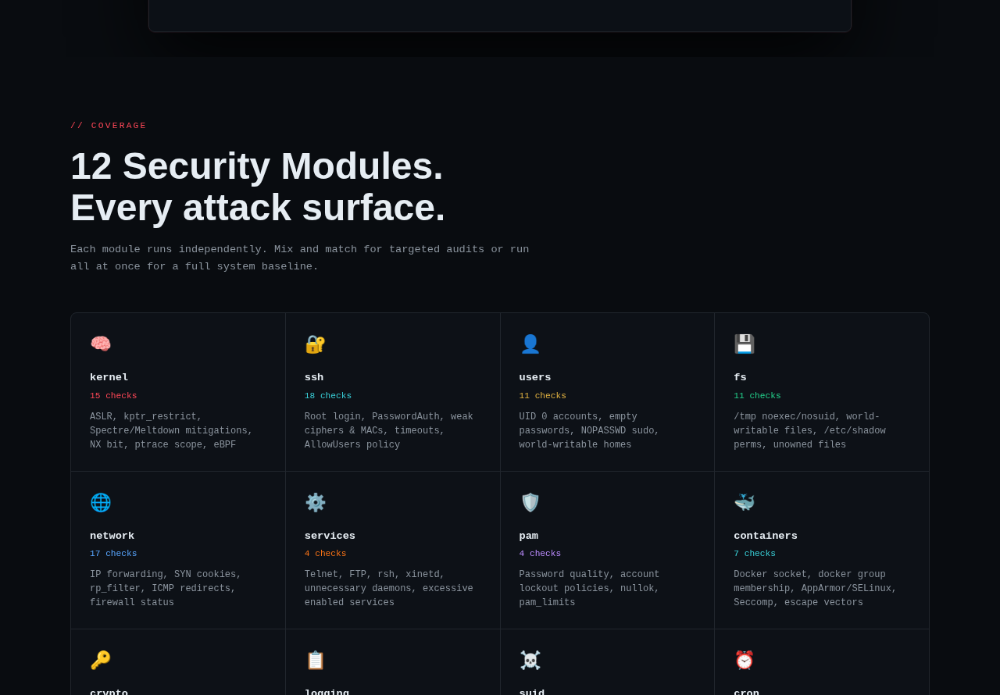
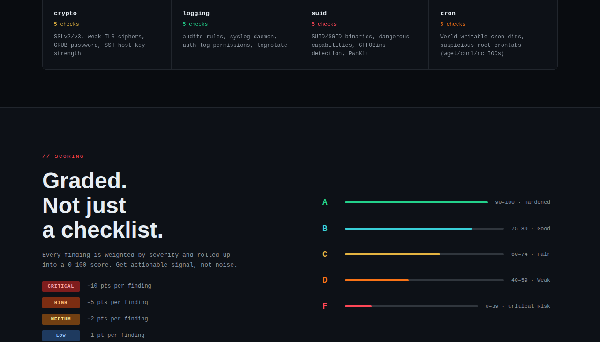

# 🛡️ HardNix — System Hardening Auditor

> A comprehensive Linux security auditing tool for red teamers, pentesters, and security engineers.

#

#

HardNix performs **107+ automated security checks** across 12 modules and produces a scored, graded report in terminal, JSON, or HTML format. Built for speed, portability, and depth — no dependencies beyond standard Linux tools.

🌐 **[Live Demo Page →](https://siteq8.github.io/hardnix)**

---

## 📸 Screenshots

### Hero — Live Terminal Output

### 12 Security Modules

### Scoring System

---

## ✨ Features

- **12 security modules** covering the entire Linux attack surface
- **Scoring system** (0–100) with letter grades (A → F)
- **Severity levels**: CRITICAL / HIGH / MEDIUM / LOW / INFO
- **Three output formats**: terminal (colored), JSON, HTML (dark theme)
- **Zero dependencies** — pure Bash, standard Linux tools only
- **GTFOBins-aware** SUID/capability detection
- **Container escape vector** detection (Docker, AppArmor, Seccomp)
- **Root-aware** — gracefully skips checks requiring root when unprivileged
- **CI/CD friendly** — exit codes, \`--no-color\`, JSON output

---

## 📦 Installation

\`\`\`bash
git clone https://github.com/siteq8/hardnix.git
cd hardnix
chmod +x hardnix.sh
\`\`\`

---

## 🚀 Usage

\`\`\`bash
# Full audit (root for complete coverage)
sudo ./hardnix.sh

# Run specific modules only
sudo ./hardnix.sh -m ssh,kernel,users

# Verbose — show passing checks too
sudo ./hardnix.sh -v

# Save JSON report
sudo ./hardnix.sh -f json -o /tmp/reports

# Generate HTML report (dark theme, open in browser)
sudo ./hardnix.sh -f html

# No color — for piping / CI pipelines
sudo ./hardnix.sh -n | tee audit.txt
\`\`\`

---

## 🔬 Modules

| Module       | Checks | Description |
|--------------|--------|-------------|
| \`kernel\`     | 15     | ASLR, kptr_restrict, Spectre/Meltdown, NX bit, ptrace scope, eBPF |
| \`ssh\`        | 18     | Root login, PasswordAuth, weak ciphers & MACs, timeouts, AllowUsers |
| \`users\`      | 11     | UID 0 accounts, empty passwords, NOPASSWD sudo, world-writable homes |
| \`fs\`         | 11     | Mount options (noexec/nosuid), world-writable files, /etc/shadow perms |
| \`network\`    | 17     | IP forwarding, SYN cookies, rp_filter, ICMP redirects, firewall |
| \`services\`   | 4      | Telnet, FTP, rsh, xinetd, excessive enabled services |
| \`pam\`        | 4      | Password quality, account lockout, nullok, pam_limits |
| \`containers\` | 7      | Docker socket, docker group, rootless mode, AppArmor/SELinux, Seccomp |
| \`crypto\`     | 5      | SSLv2/v3, weak TLS ciphers, GRUB password, SSH host key strength |
| \`logging\`    | 5      | auditd rules, syslog daemon, auth log permissions, logrotate |
| \`suid\`       | 5      | SUID/SGID binaries, dangerous capabilities, GTFOBins detection, PwnKit |
| \`cron\`       | 5      | World-writable cron dirs, suspicious root crontabs (wget/curl/nc IOCs) |

---

## 📊 Scoring

HardNix produces a **0–100 score** based on failed check severity:

| Severity | Points Deducted |
|----------|-----------------|
| CRITICAL | −10 pts |
| HIGH     | −5 pts  |
| MEDIUM   | −2 pts  |
| LOW      | −1 pt   |

| Score  | Grade |
|--------|-------|
| 90–100 | 🟢 A — Hardened |
| 75–89  | 🔵 B — Good |
| 60–74  | 🟡 C — Fair |
| 40–59  | 🟠 D — Weak |
| 0–39   | 🔴 F — Critical Risk |

---

## 🖥️ Output Examples

### Terminal (default)
\`\`\`
━━━  SSH DAEMON  ━━━━━━━━━━━━━━━━━━━━━━━━━━━━━━━━━━━━━━━━━━━━━━━━━
  ❌ [CRITICAL ] [S-001]    Root login disabled
     ↳ PermitRootLogin = yes
  ✅ [HIGH     ] [S-002]    Password authentication disabled
  ❌ [HIGH     ] [S-014]    Weak SSH ciphers configured
     ↳ arcfour,3des-cbc detected

━━━  AUDIT SUMMARY  ━━━━━━━━━━━━━━━━━━━━━━━━━━━━━━━━━━━━━━━━━━━━━━
  Score  : 62 / 100
  Grade  : C — Fair
\`\`\`

### JSON (\`-f json\`)
\`\`\`json
{
  "meta": { "tool": "HardNix", "version": "1.0.0", "hostname": "prod-server" },
  "score": 62,
  "grade": "C — Fair",
  "stats": { "total": 107, "passed": 79, "failed": 22, "warnings": 6 },
  "findings": [
    { "module": "ssh", "id": "S-001", "severity": "CRITICAL",
      "status": "FAIL", "title": "Root login disabled",
      "detail": "PermitRootLogin = yes" }
  ]
}
\`\`\`

### HTML (\`-f html\`)
A self-contained dark-theme report with severity badges grouped by module, requiring no external dependencies.

---

## 🔒 Ethical Use

For **authorized** assessments only. Use on systems you own or have explicit written permission to audit. Never run against systems without authorization.

---

## 🤝 Contributing

1. Open the relevant module in \`modules/\`
2. Call \`record_check "<module>" "<ID>" "<SEVERITY>" "<STATUS>" "<title>" "<detail>"\`
3. Submit a PR describing the check and why it matters

---

## 📄 License

MIT — see [LICENSE](LICENSE)

---

## 🙏 References

- [CIS Benchmarks](https://www.cisecurity.org/cis-benchmarks/)
- [GTFOBins](https://gtfobins.github.io/)
- [Linux Kernel Self-Protection Project](https://kernsec.org/wiki/index.php/Kernel_Self_Protection_Project)
- [lynis](https://cisofy.com/lynis/)
